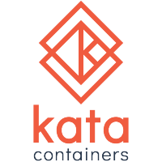
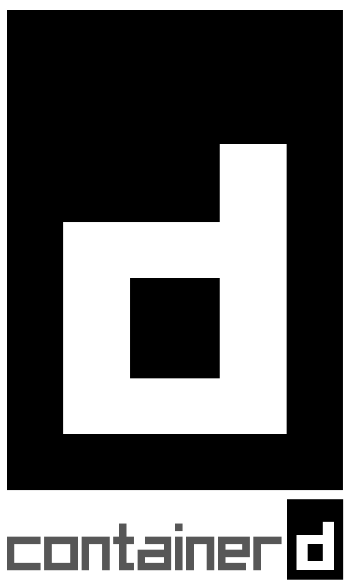
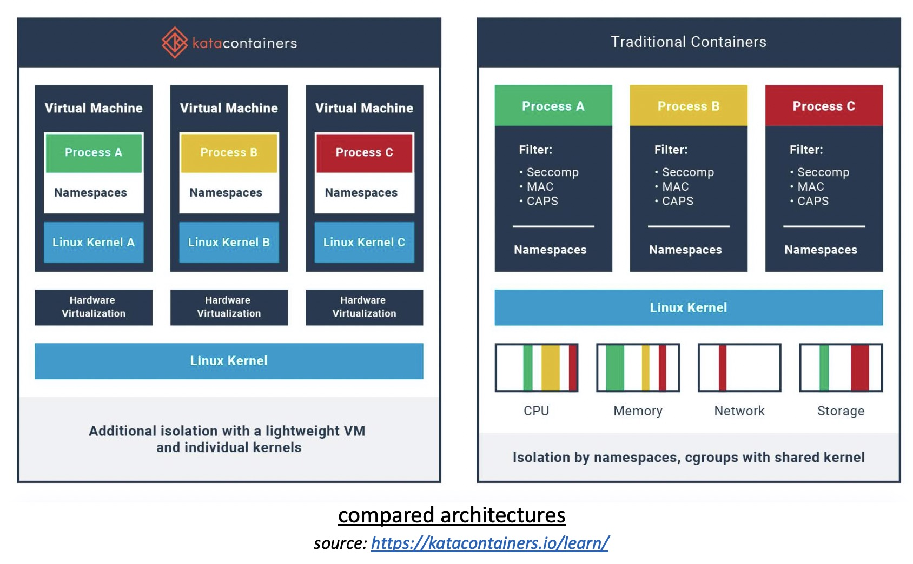
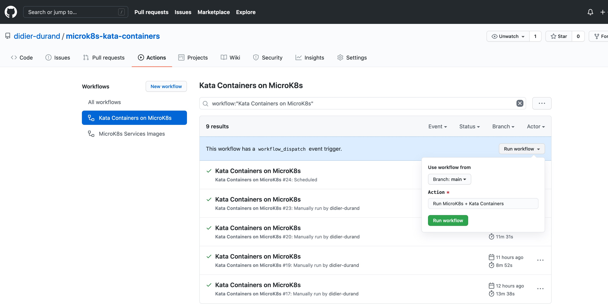

# Kata Containers on MicroK8s

* [Goal](README.md#goal)
* [Kata Containers - Rationale](README.md#kata-containers---rationale)
* [Specific Setup](README.md#specific-setup)
* [Workflow Steps](README.md#workflow-steps)
* [How to Fork & Run](README.md#how-to-fork--run)
* [Execution Report](README.md#execution-report)

## Goal

[**Nota Bene:** This repository is **Work In Progress (WIP)**: currently, we abruptly replace *"[runc](https://github.com/opencontainers/runc)"* binary, initially packaged with MicroK8s, with a symbolic link (symlink) to *"[kata-runtime](https://github.com/kata-containers/runtime)"*  binary, installed on the Ubuntu instance from project's GitHub repository and added to the MicroK8s [snap](https://en.wikipedia.org/wiki/Snap_(package_manager)) in early steps of this workflow. This initial (very) direct shortcut is possible because both binaries fully respect the [OCI runtime specification](https://opencontainers.org/). Next version of this repo will properly adapt the configuration of [containerd](https://containerd.io/) (via changes in containerd.toml) and implement the K8s [RuntimeClass](https://kubernetes.io/docs/concepts/containers/runtime-class/) to be able to dynamically choose the runtime on per container basis: proper directives in Deployment yaml manifests will allow simultaneous use of *"runc"* and *"kata-runtime"* in parallel by different containers having different execution requirements.]

This repository encompasses a fully scripted Github workflow (via [microk8s-kata.yml](.github/workflows/microk8s-kata.yml) calling [microk8s-kata.sh](sh/microk8s-kata.sh)) to test the transparent use of the runtime for Kata Containers (Katas) on MicroK8s. It must run on a quite specific Google Cloud Engine (GCE) instance since so-called *"[nested virtualization](https://pve.proxmox.com/wiki/Nested_Virtualization)"* is required by Katas when running on the cloud due to its embedded virtual machine coming on top of the cloud hypervisor managing the Linux host. Some sample containerized services (see [helloworld.go](src/go/helloworld/helloworld.go) and [autoscale.go](src/go/autoscale/autoscale.go) built automatically with this [side job](.github/workflows/build-docker-images.yml)) are deployed from Docker Hub and executed as Kubernetes services on MicroK8s.

The workflow tests the proper execution of sample containers with 'kata-runtime' after running them initially on standard 'runc' to validate global setup: beyond run of traditional helloworld-go, autoscale-go is called with parameters ensuring that thorough computations and resource allocation are properly executed by the replacing runtime.

[MicroK8s](https://microk8s.io/) by Canonical was chosen on purpose for this project: its source code is extremely close to the upstream version of Kubernetes. Consequently, it allows to build a fully-featured production-grade Kubernetes cluster that can be run autonomously - on a single Limux instance - with very sensible default configuration allowing a quick setup, quite representative of a productive system.

To automatically confirm the validity of this workflow overtime when new versions of the various components (Kata Containers, MicroK8s, Podman, Ubuntu, etc.) get published, cron schedules it on a recurring basis: execution logs can be seen in [Actions tab](https://github.com/didier-durand/microk8s-kata-containers/actions). Excerpts of last execution are gathered [further down in this page](README.md#execution-report).

**Forking and re-using on your own is strongly encouraged!** All comments for improvements and extensions will be welcome. Finally, if you like this repo, please give a Github star so that it gets more easily found by others.

## Kata Containers - Rationale

As per [Katas' website](https://katacontainers.io/): *"Kata Containers is an open source community working to build a secure container runtime with lightweight virtual machines that feel and perform like containers, but provide stronger workload isolation using hardware virtualization technology as a second layer of defense."*

This added lightweight virtual machine comes with a dedicated Linux kernel, providing isolation of network, I/O and memory and utilizes hardware-enforced isolation through Intel's [VT-x features](https://en.wikipedia.org/wiki/X86_virtualization#Intel_virtualization_(VT-x)) for virtualization. 

The use of a per-container dedicated kernel and lightweight virtual machines, provided by either [Qemu](https://www.qemu.org/) or [Amazon's Firecracker](https://firecracker-microvm.github.io/), creates a much stronger isolation between the containers themselves and with the host. For example, if a container misbehaves and messes up with the kernel resources by overconsuming or corrupting them, it's only **HIS** dedicated kernel that gets damaged, not the unique kernel shared between all containers and host, as when you're using regular containers. The picture above shows the clear differences between the two architectures. So, Kata Containers are probably the best option currently available for additional security and reliability with untrusted workloads of all kinds (recent versions, external source code, etc.). 

As you would expect, this further level of isolation through additional virtualization comes with a performance / cost penalty but this [comparative study](https://object-storage-ca-ymq-1.vexxhost.net/swift/v1/6e4619c416ff4bd19e1c087f27a43eea/www-assets-prod/presentation-media/kata-containers-and-gvisor-a-quantitave-comparison.pdf) between the performances of raw host performances, *"runc"*, [Google's gVisor](https://gvisor.dev/) containers and Kata Containers demonstrates that the overhead remains quite acceptable in many situations for the additional security that is delivered. Look at slides 19 to 26 of the linked pdf to get the exact numbers.

## Specific Setup

Various specific points have to be part of this workflow:

1. [Katas on GCE](https://github.com/kata-containers/documentation/blob/master/install/gce-installation-guide.md) implies use of [nested virtualization](https://en.wikipedia.org/wiki/Virtualization#Nested_virtualization): this requires to create a [specific GCE image](https://cloud.google.com/compute/docs/instances/enable-nested-virtualization-vm-instances) to activate the [Intel VT-x instruction set](https://en.wikipedia.org/wiki/X86_virtualization#Intel_virtualization_(VT-x)). This is obtained by the addition of a specific option *"--licenses="* to the command *"gcloud compute images create"*. See [microk8s-kata.sh](sh/microk8s-kata.sh) for details.

2. The underlying hardware must minimally be of the Intel's [Broadwell architecture generation](https://en.wikipedia.org/wiki/Broadwell_(microarchitecture)) to provide the VT-x instructions. This is guaranteed by adding *"--min-cpu-platform 'Intel Broadwell'"* to the command *"gcloud compute instances create"*. See [microk8s-kata.sh](sh/microk8s-kata.sh) for details.

3. [Podman CLI](https://podman.io/) is used instead of Docker CLI because Docker is not compatible with Kata Containers runtime 2.0. As this article explains it, the transition from Docker to Podman is very easy: command syntax and resuls are extremely close and even identical in most cases.

## Workflow Steps

The major steps in this workflow are: 

1. Check that GCE instance is proper ('GenuineIntel') - according to the above requirement for Broadwell - via lscpu after it has been created.
2. Install Kata Containers runtime directly from the Github repository of the project.
3. Check that this added runtime can run on the instance: command *"kata-runtime kata-check"* MUST produce output *"System is capable of running Kata Containers"*
4. Install Podman and check via *"podman info"* that it sees both its standard runtime *"runc"* and the newly added *"kata-runtime"*
5. Run the latest version of [Alpine Linux](https://en.wikipedia.org/wiki/Alpine_Linux) image with selection of kata-runtime (*"--runtime='kata-runtime"*) and verify through *"podman inspect"* that the running Alpine is effectively using kata-runtime.
6. Install MicroK8s via snap and check that it works properly via the deployment of [helloworld-go.yml](kubernetes/helloworld-go.yml) and [autoscale-go.yml](kubernetes/autoscale-go.yml) service manifests, built from from GoLang source code in [src/go directory](src/go). Stop MicroK8s when validation is successful.
7. Open the MicroK8s .snap file to add kata-runtime and repackage a new version (now unsigned) of the .snap file. Please, note use of *"unsquashfs"* and *"mksquashfs"* to achieve this refurbishing since the [snap archive format](https://en.wikipedia.org/wiki/Snap_(package_manager)) is based on read-only and compressed [SquashFS](https://en.wikipedia.org/wiki/SquashFS) Linux file system.
8. Remove old MicroK8s installation and re-install a fresh instance based with newly created snap version: *"--dangerous"* option is now required since the tweaked .snap is no longer signed by its official provider, Canonical.
9. Deploy again helloworld-go and autoscale-go on fresh MicroK8s to validate that they work fine with kata-runtime: autoscale-go request is parametrized to make sure that some amount computing resources are consumed to achieve a better validation.

## How to Fork & Run

To start with, you need a Google Cloud account including a project where the GCE APIs have been enabled. Obtain the id of your project from 
GCP dashboard. Additionally, you need to create in this project a service account (SA) and give it proper GCE credentials: right to create, administer and delete GCE images & instances (if your cannot  make the SA a "Project Owner" to simplify the security aspects...). Save the private key of the SA in json format.

Then, fork our repository and define the required [Github Secrets](https://docs.github.com/en/actions/reference/encrypted-secrets) in your fork: 

1. your GCP project id will be {{ secrets.GCP_PROJECT }}
2. The private key of your service account in json format will be ${{ secrets.GCP_SA_KEY }} 

To easily use the workflow from Github, you can launch it with the [manual dispatch feature of Github](https://github.blog/changelog/2020-07-06-github-actions-manual-triggers-with-workflow_dispatch/) that you can see as a launch button (the green one in the picture below) in the Action tab of your fork.

The workflow will execute all the steps described above and terminate gracefully after all validation tests described are completed: it will then delete the GCE instance and the associated image triggering the nested virtualization.

If you also want to make use of the [side workflow](.github/workflows/build-docker-images.yml) allowing to build the test container images from their GoLang sources, you'll need to add 2 additional secrets : {{ secrets.DOCKER_USERID }} & {{ secrets.DOCKER_PASSWORD }} corresponding to the login parameters of your [Docker Hub account](https://hub.docker.com/).

## Execution Report

Below are some relevant excerpts of the last execution log:

